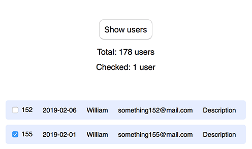

# Practice - JS14 - React basics

1. Реалізуйте компонент, який буде містити дві кнопки `+` та `-`, а також поле з числом. При кліку на `+` і `-` число збільшується або зменшується.

   * Якщо число менше `0`, його колір - червоний
   * Якщо більше `0` - зелений
   * Якщо дорівнює `0` - чорний
   
   

2. Реалізуйте таку логіку:
    * На екрані є 1 кнопка `Show users`
    * При кліку на `Show users` отримати дані з `https://tanuhaua.github.io/datas-file-json/visitors.json` і відобразити їх у вигляді списку або карток. Кнопка `Show users` зникає. 
    * Вгорі на сторінці повинно бути 2 повідомлення: `Total: {n} users`, `Checked: {n} users`
    * У кожного рядка (або картки) повинен бути чекбокс, при кліку на який повинно змінюватись число `{n}` в `Checked: {n} users`;
    
    
    
    Обов'язкові компоненти в даному завданні (можете створювати додаткові):
    * Загальний компонент сторінки
    * Кнопка `Show users`
    * Рядок (картка) користувача
    * Повідомлення про кількість користувачів